# Web Application Document - Projeto Individual - Módulo 2 - Inteli

## Project Pokemon Database

#### Marcos V. M. S.

## Sumário

1. [Introdução](#c1)
2. [Visão Geral da Aplicação Web](#c2)
3. [Projeto Técnico da Aplicação Web](#c3)
4. [Desenvolvimento da Aplicação Web](#c4)
5. [Referências](#c5)

<br>

## <a name="c1"></a>1. Introdução

O Projeto Pokemon Database é uma aplicação web desenvolvida para gerenciar uma base de dados inspirada no universo Pokémon. Utilizando tecnologias como Express.js, PostgreSQL e Sequelize, o sistema possibilita o cadastro, consulta e gerenciamento de Pokémons, suas espécies e tipos, bem como a administração de equipes e itens associados.

A aplicação adota uma arquitetura clara e modular, separando a lógica de negócio (Models e Controllers) da interface de acesso (Rotas). Essa estrutura permite não apenas uma manutenção facilitada, mas também a escalabilidade do sistema conforme novas funcionalidades sejam implementadas. Além disso, o projeto contempla scripts específicos para a inicialização do banco de dados e populações de teste, garantindo um ambiente pronto para desenvolvimento e demonstração.

Ideal para entusiastas do universo Pokémon e desenvolvedores que buscam aprofundar seus conhecimentos em desenvolvimento web e gerenciamento de bancos de dados, este projeto alia conceitos teóricos e práticos em um cenário real de aplicação. Através desta plataforma, espera-se oferecer uma experiência interativa e enriquecedora, servindo tanto como ferramenta de aprendizado quanto de entretenimento.

Este documento apresenta, de forma detalhada, a modelagem do banco de dados, a arquitetura da aplicação e os principais endpoints que possibilitam a interação com o sistema, estabelecendo uma base sólida para futuras melhorias e expansões.

---

## <a name="c2"></a>2. Visão Geral da Aplicação Web

---

## <a name="c3"></a>3. Projeto da Aplicação Web

### 3.1. Modelagem do banco de dados

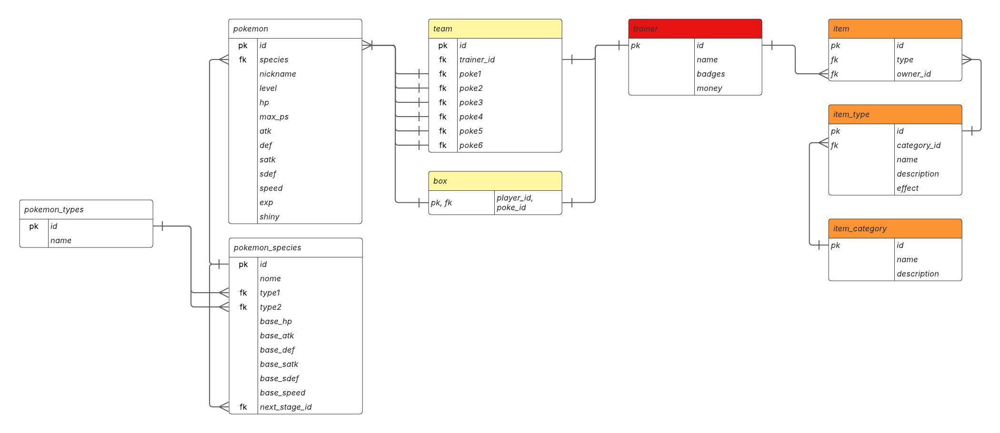

<p align="center">Figura 1 - Diagrama de Entidade Relacional do banco de dados</p>

Arquivo de modelagem física do banco de dados: [initDB.sql](../scripts/initDB.sql)

Este diagrama de Entidade-Relacionamento (DER) descreve um banco de dados projetado para gerenciar informações relacionadas a um universo similar ao de Pokémon. Ele permite o rastreamento de treinadores, seus Pokémon (tanto os da equipe ativa quanto os armazenados), e os itens que possuem, além de catalogar as espécies de Pokémon e os tipos de itens.

A estrutura do banco de dados é composta pelas seguintes tabelas principais:

- **`trainer` (Treinador):** Armazena informações sobre os treinadores, incluindo um ID único (`pk`, tipo UUID), nome (`name`, VARCHAR), o número de insígnias (`badges`, INT) e a quantidade de dinheiro (`money`, INT) que possuem.
- **`team` (Equipe):** Representa a equipe ativa de Pokémon de um treinador. Contém um ID único (`pk`, UUID), o ID do treinador ao qual a equipe pertence (`trainer_id`, UUID), e os IDs dos seis Pokémon que compõem a equipe (`poke1` a `poke6`, todos UUID). Há uma relação de um-para-um com `trainer` (uma equipe por treinador) e relações de muitos-para-um com a tabela `pokemon` (cada slot de equipe aponta para um Pokémon individual).
- **`box` (Caixa):** Permite armazenar Pokémon que não estão na equipe ativa de um treinador. É uma tabela de ligação que conecta um `trainer_id` (UUID) a um `poke_id` (UUID), indicando quais Pokémon estão guardados por qual treinador.
- **`pokemon` (Pokémon Individual):** Contém os dados de um Pokémon específico possuído por um treinador. Inclui um ID único (`pk`, UUID), o ID da espécie (`species`, UUID), um apelido (`nickname`, VARCHAR), nível (`level`, INT), pontos de vida atuais e máximos (`hp`, `max_hp`, INT), estatísticas de ataque, defesa, ataque especial, defesa especial e velocidade (`atk`, `def`, `spatk`, `spdef`, `speed`, todos INT), experiência (`exp`, INT) e um indicador booleano se é shiny (`shiny`, BOOL). Esta tabela se relaciona com `pokemon_species`.
- **`pokemon_species` (Espécie de Pokémon):** Descreve as características base de uma espécie de Pokémon. Possui um ID único (`pk`, UUID), nome da espécie (`name`, VARCHAR), e IDs para seus tipos (`type1`, `type2`, ambos UUID). Também armazena as estatísticas base (`base_hp`, `base_atk`, `base_def`, `base_spatk`, `base_spdef`, `base_speed`, todos INT) e o ID da próxima estágio evolutivo (`next_stage_id`, UUID), permitindo encadear evoluções.
- **`pokemon_types` (Tipos de Pokémon):** Uma tabela de referência para os tipos de Pokémon (ex: Água, Fogo, Grama). Contém um ID único (`pk`, UUID) e o nome do tipo (`name`, VARCHAR).
- **`item` (Item Individual):** Representa um item específico que um treinador possui. Inclui um ID único (`pk`, UUID), o ID do tipo de item (`type`, UUID) e o ID do treinador que possui o item (`trainer_id`, UUID).
- **`item_type` (Tipo de Item):** Define as características de um tipo de item. Contém um ID único (`pk`, UUID), o ID da categoria do item (`category_id`, UUID), uma descrição (`description`, VARCHAR) e o efeito do item (`effect`, VARCHAR).
- **`item_category` (Categoria de Item):** Classifica os tipos de itens em categorias mais amplas (ex: Pokébolas, Poções, Itens Chave). Possui um ID único (`pk`, UUID), nome da categoria (`name`, VARCHAR) e uma descrição mais longa (`description`, TEXT).

**Relacionamentos Chave:**

- Um **`trainer`** pode possuir muitos **`item`s**, e um **`item`** pertence a um **`trainer`**.
- Um **`trainer`** possui uma única **`team`**, e uma **`team`** pertence a um **`trainer`**.
- Um **`trainer`** pode ter muitos **`pokemon`** armazenados em **`box`**, e um **`pokemon`** na **`box`** está associado a um **`trainer`**.
- Um **`team`** é composto por até seis **`pokemon`** individuais.
- Um **`pokemon`** (individual) é de uma **`pokemon_species`**, e uma **`pokemon_species`** pode ter muitos **`pokemon`** (indivíduo).
- Uma **`pokemon_species`** pode ter até dois **`pokemon_types`**, e um **`pokemon_type`** pode ser associado a muitas **`pokemon_species`**.
- Um **`item`** (individual) é de um **`item_type`**, e um **`item_type`** pode gerar muitos **`item`s** (indivíduos).
- Um **`item_type`** pertence a uma **`item_category`**, e uma **`item_category`** pode ter muitos **`item_type`s**.

Este design de banco de dados é flexível e extensível, permitindo adicionar novas funcionalidades como trocas, batalhas, e outras mecânicas de jogo, mantendo a integridade e organização dos dados.

### 3.1.1 BD e Models

garantindo a integração entre a camada de persistência e a lógica de negócio. Cada modelo Sequelize representa uma tabela do banco de dados e está localizado na pasta `models/`. Abaixo, segue a relação entre os arquivos JavaScript responsáveis pela definição dos modelos e as respectivas tabelas do banco de dados:

- [**`models/Trainer.js`**](../models/trainerModel.js): Define o modelo `Trainer`, correspondente à tabela `trainer`.
- [**`models/Team.js`**](../models/teamModel.js): Define o modelo `Team`, correspondente à tabela `team`.
- [**`models/Box.js`**](../models/boxModel.js): Define o modelo `Box`, correspondente à tabela `box`.
- [**`models/Pokemon.src/models/Pokemon.js`**](../models/pokemonModel.js): Define o modelo `Pokemon`, correspondente à tabela `pokemon`.
- [**`models/PokemonSpecies.js`**](../models/pokemonSpeciesModel.js): Define o modelo `PokemonSpecies`, correspondente à tabela `pokemon_species`.
- [**`models/PokemonType.js`**](../models/pokemonTypeModel.js): Define o modelo `PokemonType`, correspondente à tabela `pokemon_types`.
- [**`models/Item.js`**](../models/itemModel.js): Define o modelo `Item`, correspondente à tabela `item`.
- [**`models/ItemType.js`**](../models/itemTypeModel.js): Define o modelo `ItemType`, correspondente à tabela `item_type`.
- [**`models/ItemCategory.js`**](../models/itemCategoryModel.js): Define o modelo `ItemCategory`, correspondente à tabela `item_category`.

Esses arquivos são importados e utilizados nos controllers localizados em `controllers/`, que implementam a lógica de acesso e manipulação dos dados via API. Dessa forma, a estrutura do projeto mantém uma separação clara entre definição dos dados (models), regras de negócio (controllers) e rotas de acesso (routes), promovendo organização, reutilização e facilidade de manutenção.

### 3.2. Arquitetura

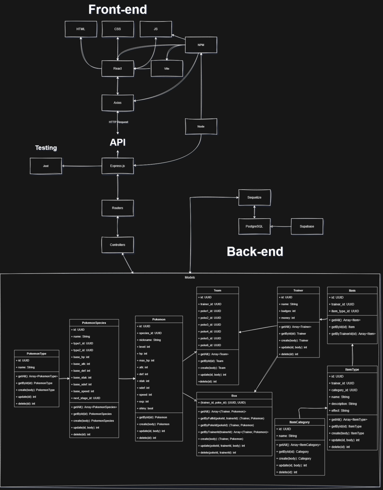

O diagrama acima ilustra a arquitetura da aplicação, que segue o padrão MVC (Model-View-Controller) e está dividida em duas camadas principais: **Front-end** e **Back-end**.

#### **Front-end**

- **HTML, CSS e JS**: São as tecnologias base para a construção da interface do usuário.
- **React**: Biblioteca JavaScript utilizada para criar interfaces de usuário dinâmicas e reativas.
- **Vite**: Ferramenta de build que otimiza o desenvolvimento e a entrega do front-end.
- **Axios**: Biblioteca para realizar requisições HTTP, conectando o front-end ao back-end.

#### **Back-end**

- **Node.js**: Ambiente de execução para JavaScript no lado do servidor.
- **Express.js**: Framework para criar a API RESTful que gerencia as requisições e respostas.
- **Sequelize**: ORM (Object-Relational Mapping) que facilita a interação com o banco de dados PostgreSQL.
- **PostgreSQL**: Banco de dados relacional utilizado para armazenar as informações da aplicação.
- **Supabase**: Ferramenta que complementa o PostgreSQL, oferecendo funcionalidades adicionais como autenticação e armazenamento.

#### **Fluxo de Dados**

1. O usuário interage com a interface no navegador (HTML, CSS, JS).
2. As ações do usuário são processadas pelo React, que utiliza o Axios para enviar requisições HTTP para a API.
3. A API, construída com Express.js, recebe as requisições e as encaminha para os controllers.
4. Os controllers processam as requisições, interagindo com os models definidos no Sequelize.
5. O Sequelize traduz as operações para comandos SQL, que são executados no banco de dados PostgreSQL.
6. Os dados retornam pelo mesmo caminho, sendo enviados do banco para os models, dos models para os controllers, e dos controllers para o front-end, onde são exibidos ao usuário.

Essa arquitetura modular promove a separação de responsabilidades, facilitando a manutenção, escalabilidade e testes da aplicação.

### 3.6. WebAPI e endpoints (Semana 05)

A API REST do Pokemon Database oferece endpoints completos para gerenciar todas as entidades do sistema. Todos os endpoints seguem os padrões REST e retornam dados em formato JSON.

**Base URL:** `http://localhost:3000`

#### 3.6.1. Trainers (Treinadores)

| Método | Endpoint        | Descrição                  | Parâmetros                           | Response                  |
| ------ | --------------- | -------------------------- | ------------------------------------ | ------------------------- |
| GET    | `/trainers`     | Lista todos os treinadores | -                                    | Array de objetos Trainer  |
| GET    | `/trainers/:id` | Busca treinador por ID     | `id` (UUID)                          | Objeto Trainer            |
| POST   | `/trainers`     | Cria novo treinador        | Body: `{name, money?, badges?}`      | Objeto Trainer criado     |
| PUT    | `/trainers/:id` | Atualiza treinador         | `id` (UUID), Body: dados a atualizar | Objeto Trainer atualizado |
| DELETE | `/trainers/:id` | Remove treinador           | `id` (UUID)                          | Mensagem de confirmação   |

**Exemplo de resposta Trainer:**

```json
{
  "id": "uuid-v4",
  "name": "Ash Ketchum",
  "money": 5000,
  "badges": 8,
  "createdAt": "2025-05-25T10:00:00.000Z",
  "updatedAt": "2025-05-25T10:00:00.000Z"
}
```

#### 3.6.2. Pokémons

| Método | Endpoint        | Descrição               | Parâmetros                                                                                | Response                  |
| ------ | --------------- | ----------------------- | ----------------------------------------------------------------------------------------- | ------------------------- |
| GET    | `/pokemons`     | Lista todos os pokémons | -                                                                                         | Array de objetos Pokemon  |
| GET    | `/pokemons/:id` | Busca pokémon por ID    | `id` (UUID)                                                                               | Objeto Pokemon            |
| POST   | `/pokemons`     | Cria novo pokémon       | Body: `{species_id, level, nickname?, hp, atk, def, sp_atk, sp_def, speed, exp?, shiny?}` | Objeto Pokemon criado     |
| PUT    | `/pokemons/:id` | Atualiza pokémon        | `id` (UUID), Body: dados a atualizar                                                      | Objeto Pokemon atualizado |
| DELETE | `/pokemons/:id` | Remove pokémon          | `id` (UUID)                                                                               | Mensagem de confirmação   |

#### 3.6.3. Espécies de Pokémon

| Método | Endpoint               | Descrição               | Parâmetros                                                                                             | Response                         |
| ------ | ---------------------- | ----------------------- | ------------------------------------------------------------------------------------------------------ | -------------------------------- |
| GET    | `/pokemon-species`     | Lista todas as espécies | -                                                                                                      | Array de objetos PokemonSpecies  |
| GET    | `/pokemon-species/:id` | Busca espécie por ID    | `id` (UUID)                                                                                            | Objeto PokemonSpecies            |
| POST   | `/pokemon-species`     | Cria nova espécie       | Body: `{name, type1_id, type2_id?, base_hp, base_atk, base_def, base_sp_atk, base_sp_def, base_speed}` | Objeto PokemonSpecies criado     |
| PUT    | `/pokemon-species/:id` | Atualiza espécie        | `id` (UUID), Body: dados a atualizar                                                                   | Objeto PokemonSpecies atualizado |
| DELETE | `/pokemon-species/:id` | Remove espécie          | `id` (UUID)                                                                                            | Mensagem de confirmação          |

#### 3.6.4. Tipos de Pokémon

| Método | Endpoint     | Descrição            | Parâmetros                           | Response                |
| ------ | ------------ | -------------------- | ------------------------------------ | ----------------------- |
| GET    | `/types`     | Lista todos os tipos | -                                    | Array de objetos Type   |
| GET    | `/types/:id` | Busca tipo por ID    | `id` (UUID)                          | Objeto Type             |
| POST   | `/types`     | Cria novo tipo       | Body: `{name}`                       | Objeto Type criado      |
| PUT    | `/types/:id` | Atualiza tipo        | `id` (UUID), Body: dados a atualizar | Objeto Type atualizado  |
| DELETE | `/types/:id` | Remove tipo          | `id` (UUID)                          | Mensagem de confirmação |

#### 3.6.5. Equipes (Teams)

| Método | Endpoint     | Descrição              | Parâmetros                                                     | Response                |
| ------ | ------------ | ---------------------- | -------------------------------------------------------------- | ----------------------- |
| GET    | `/teams`     | Lista todas as equipes | -                                                              | Array de objetos Team   |
| GET    | `/teams/:id` | Busca equipe por ID    | `id` (UUID)                                                    | Objeto Team             |
| POST   | `/teams`     | Cria nova equipe       | Body: `{trainerId, pokemon1Id, pokemon2Id?, ..., pokemon6Id?}` | Objeto Team criado      |
| PUT    | `/teams/:id` | Atualiza equipe        | `id` (UUID), Body: dados a atualizar                           | Objeto Team atualizado  |
| DELETE | `/teams/:id` | Remove equipe          | `id` (UUID)                                                    | Mensagem de confirmação |

#### 3.6.6. Caixas de Armazenamento (Boxes)

| Método | Endpoint                       | Descrição                         | Parâmetros                                  | Response                |
| ------ | ------------------------------ | --------------------------------- | ------------------------------------------- | ----------------------- |
| GET    | `/boxes`                       | Lista todas as caixas             | -                                           | Array de objetos Box    |
| GET    | `/boxes/:trainerId/:pokemonId` | Busca entrada específica na caixa | `trainerId` (UUID), `pokemonId` (UUID)      | Objeto Box              |
| POST   | `/boxes`                       | Adiciona pokémon à caixa          | Body: `{trainerId, pokemonId}`              | Objeto Box criado       |
| PUT    | `/boxes/:trainerId/:pokemonId` | Atualiza entrada na caixa         | IDs nos parâmetros, Body: dados a atualizar | Objeto Box atualizado   |
| DELETE | `/boxes/:trainerId/:pokemonId` | Remove pokémon da caixa           | `trainerId` (UUID), `pokemonId` (UUID)      | Mensagem de confirmação |

#### 3.6.7. Itens

| Método | Endpoint     | Descrição            | Parâmetros                           | Response                |
| ------ | ------------ | -------------------- | ------------------------------------ | ----------------------- |
| GET    | `/items`     | Lista todos os itens | -                                    | Array de objetos Item   |
| GET    | `/items/:id` | Busca item por ID    | `id` (UUID)                          | Objeto Item             |
| POST   | `/items`     | Cria novo item       | Body: `{ownerId, typeId}`            | Objeto Item criado      |
| PUT    | `/items/:id` | Atualiza item        | `id` (UUID), Body: dados a atualizar | Objeto Item atualizado  |
| DELETE | `/items/:id` | Remove item          | `id` (UUID)                          | Mensagem de confirmação |

#### 3.6.8. Categorias de Itens

| Método | Endpoint               | Descrição                 | Parâmetros                           | Response                       |
| ------ | ---------------------- | ------------------------- | ------------------------------------ | ------------------------------ |
| GET    | `/item-categories`     | Lista todas as categorias | -                                    | Array de objetos ItemCategory  |
| GET    | `/item-categories/:id` | Busca categoria por ID    | `id` (UUID)                          | Objeto ItemCategory            |
| POST   | `/item-categories`     | Cria nova categoria       | Body: `{name, description?}`         | Objeto ItemCategory criado     |
| PUT    | `/item-categories/:id` | Atualiza categoria        | `id` (UUID), Body: dados a atualizar | Objeto ItemCategory atualizado |
| DELETE | `/item-categories/:id` | Remove categoria          | `id` (UUID)                          | Mensagem de confirmação        |

#### 3.6.9. Tipos de Itens

| Método | Endpoint          | Descrição                     | Parâmetros                                      | Response                   |
| ------ | ----------------- | ----------------------------- | ----------------------------------------------- | -------------------------- |
| GET    | `/item-types`     | Lista todos os tipos de itens | -                                               | Array de objetos ItemType  |
| GET    | `/item-types/:id` | Busca tipo de item por ID     | `id` (UUID)                                     | Objeto ItemType            |
| POST   | `/item-types`     | Cria novo tipo de item        | Body: `{name, description?, effect?, category}` | Objeto ItemType criado     |
| PUT    | `/item-types/:id` | Atualiza tipo de item         | `id` (UUID), Body: dados a atualizar            | Objeto ItemType atualizado |
| DELETE | `/item-types/:id` | Remove tipo de item           | `id` (UUID)                                     | Mensagem de confirmação    |

#### 3.6.10. Códigos de Status HTTP

A API utiliza os seguintes códigos de status HTTP:

- **200 OK**: Operação realizada com sucesso (GET, PUT)
- **201 Created**: Recurso criado com sucesso (POST)
- **404 Not Found**: Recurso não encontrado
- **500 Internal Server Error**: Erro interno do servidor

#### 3.6.11. Tratamento de Erros

Todos os endpoints retornam erros no formato JSON:

```json
{
  "error": "Mensagem de erro descritiva"
}
```

#### 3.6.12. Relacionamentos

A API suporta associações entre entidades através do sistema Sequelize implementado. As relações incluem:

- **Trainer** possui muitos **Pokémon** (através de Team e Box)
- **Pokémon** pertence a uma **PokemonSpecies**
- **PokemonSpecies** possui tipos primário e secundário (**Type**)
- **Item** pertence a um **Trainer**, **ItemCategory** e **ItemType**
- **Team** conecta **Trainer** com até 6 **Pokémon**
- **Box** armazena **Pokémon** de um **Trainer**

Para detalhes sobre como utilizar as associações, consulte o [Guia de Associações](../documents/others/ASSOCIATIONS_GUIDE.md).

### 3.7 Interface e Navegação

A aplicação web PokéBase apresenta uma interface moderna e intuitiva, desenvolvida com React e estilizada com Tailwind CSS. O sistema de navegação é baseado em Single Page Application (SPA) utilizando React Router, proporcionando uma experiência fluida ao usuário.

#### 3.7.1 Estrutura de Navegação

A navegação da aplicação é centralizada através de um cabeçalho fixo que contém links para todas as seções principais. O componente `Header` oferece acesso direto às seguintes páginas:

- **Home** - Página inicial e de boas-vindas
- **Pokédex** - Catálogo de espécies Pokémon
- **Trainers** - Lista de treinadores cadastrados
- **Items** - Inventário de itens disponíveis
- **Contact** - Formulário de contato

#### 3.7.2 Páginas da Aplicação

##### 3.7.2.1 Home (Página Inicial)

A página inicial serve como ponto de entrada da aplicação, apresentando uma interface de boas-vindas limpa e atrativa.

**Funcionalidades:**

- Apresentação do nome da aplicação "PokéBase"
- Descrição resumida dos recursos disponíveis
- Call-to-action direcionando para a Pokédex
- Design responsivo com elementos centralizados

**Dados utilizados:** Nenhum (página estática)

**Navegação:** Link direto para a página Pokédex através do botão "Learn more about the pokémons"

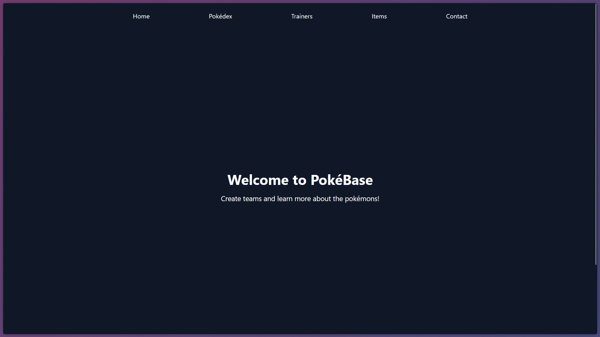

##### 3.7.2.2 Pokédex (Catálogo de Espécies)

A Pokédex representa o catálogo completo de espécies Pokémon disponíveis no sistema, oferecendo uma visão organizada das criaturas.

**Funcionalidades:**

- Listagem de todas as espécies Pokémon cadastradas
- Exibição de informações básicas (nome, tipos, ID da Pokédex)
- Sistema de fallback com dados estáticos em caso de falha na API
- Indicador de carregamento durante requisições
- Tratamento de erros com feedback visual

**Dados buscados:**

- Endpoint: `GET /api/pokemon-species`
- Informações obtidas: nome da espécie, tipos primário e secundário, estatísticas base
- Relacionamentos: tipos de Pokémon associados a cada espécie

**Componentes utilizados:**

- `List` - Container genérico para listagens
- `PokemonListItem` - Item individual de cada espécie

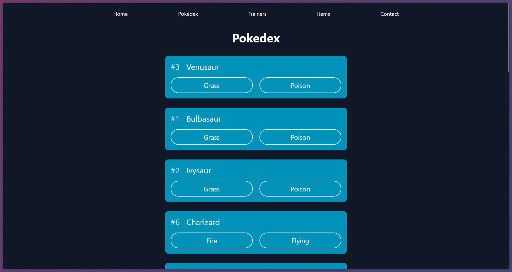

##### 3.7.2.3 Trainers (Treinadores)

A página de treinadores apresenta todos os treinadores cadastrados no sistema, exibindo suas informações principais de forma organizada.

**Funcionalidades:**

- Listagem completa de treinadores cadastrados
- Exibição de estatísticas do treinador (nome, badges, dinheiro)
- Sistema de fallback com dados de demonstração
- Tratamento de erros e estados de carregamento

**Dados buscados:**

- Endpoint: `GET /api/trainers`
- Informações obtidas: ID, nome, número de badges, quantidade de dinheiro
- Relacionamentos futuros: equipes e Pokémon associados

**Componentes utilizados:**

- `List` - Container para a listagem
- `TrainerListItem` - Representação individual de cada treinador

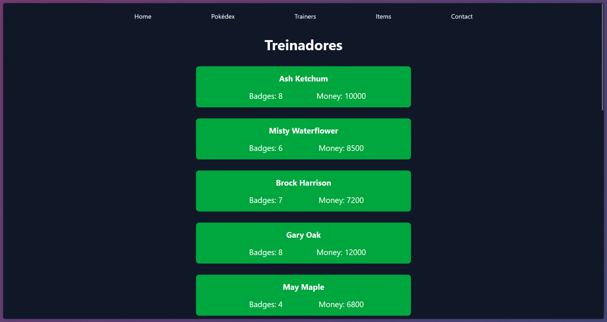

##### 3.7.2.4 Items (Itens)

A seção de itens funciona como um catálogo completo dos itens disponíveis no universo Pokémon, organizados por categorias e tipos.

**Funcionalidades:**

- Catálogo completo de itens disponíveis
- Informações detalhadas de cada item (nome, tipo, preço, descrição)
- Categorização por tipos (pokébolas, cura, aprimoramento, batalha)
- Sistema de fallback abrangente com 12 itens de exemplo

**Dados buscados:**

- Endpoint: `GET /api/items`
- Informações obtidas: ID, nome, tipo, preço, descrição, efeitos
- Relacionamentos: categorias e tipos de itens

**Componentes utilizados:**

- `List` - Container principal
- `ItemListItem` - Exibição detalhada de cada item


##### 3.7.2.5 Contact (Contato)

A página de contato oferece um canal direto de comunicação entre usuários e desenvolvedores da aplicação.

**Funcionalidades:**

- Formulário de contato com campos estruturados
- Validação de entrada para email
- Design responsivo e acessível
- Link direto para email de contato alternativo

**Campos do formulário:**

- Nome do usuário
- Email para resposta
- Organização (opcional)
- Mensagem detalhada

**Dados utilizados:** Nenhum (formulário front-end)

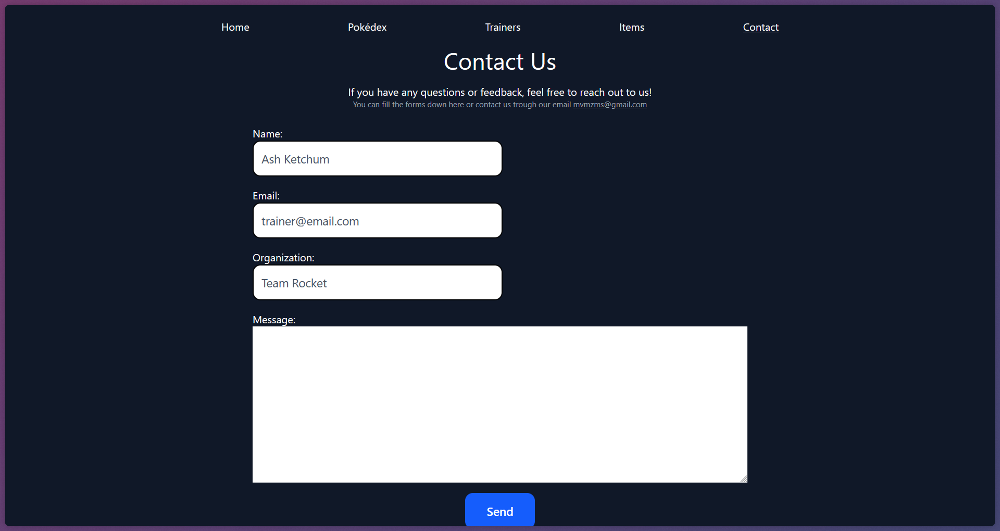

#### 3.7.3 Padrões de Interface

##### 3.7.3.1 Componentes Reutilizáveis

A aplicação utiliza um conjunto de componentes reutilizáveis para manter consistência visual:

- **`Header`**: Navegação principal fixa
- **`Footer`**: Rodapé com informações adicionais
- **`List`**: Container genérico para listagens
- **`Card`**: Exibição de informações em formato de cartão
- **`PokemonCard`**: Cartão específico para Pokémon individuais

##### 3.7.3.2 Estados da Aplicação

Todas as páginas que consomem dados da API implementam três estados principais:

1. **Loading**: Indicador visual durante carregamento
2. **Error**: Mensagem de erro com dados de fallback
3. **Success**: Exibição normal dos dados obtidos

##### 3.7.3.3 Responsividade

O design utiliza classes Tailwind CSS para garantir responsividade em diferentes dispositivos:

- Layout flexível e centralizado
- Componentes que se adaptam ao tamanho da tela
- Navegação otimizada para mobile e desktop

#### 3.7.4 Fluxo de Navegação

O fluxo de navegação segue uma estrutura simples e intuitiva:

1. **Entrada**: Usuário acessa a página Home
2. **Exploração**: Navegação livre entre seções através do header
3. **Descoberta**: Cada seção oferece informações específicas do domínio
4. **Contato**: Canal direto para feedback e suporte

A arquitetura de SPA permite transições suaves entre páginas, mantendo o estado da aplicação e oferecendo uma experiência de usuário fluida e moderna.

---

## <a name="c4"></a>4. Desenvolvimento da Aplicação Web (Semana 8)

### 4.1 Demonstração do Sistema Web (Semana 8)

### 4.1.1 Vídeo de demonstração


**[Link para o drive](https://drive.google.com/file/d/1ibsS1P5V8FcmPP03wubOtbDQaa9JRfBo/view?usp=sharing)**

### 4.1.2 Funcionalidades Implementadas

#### Sistema de Visualização Completo

O sistema oferece operações visualização completas para todas as entidades:

**Treinadores (Trainers)**

- Listagem de treinadores
- Interface para visualização de dados

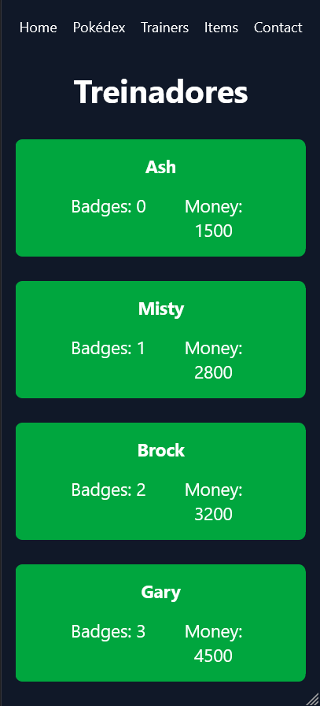

**Pokédex (Espécies)**

- Catálogo completo de espécies Pokémon
- Exibição de tipos, estatísticas base e informações detalhadas

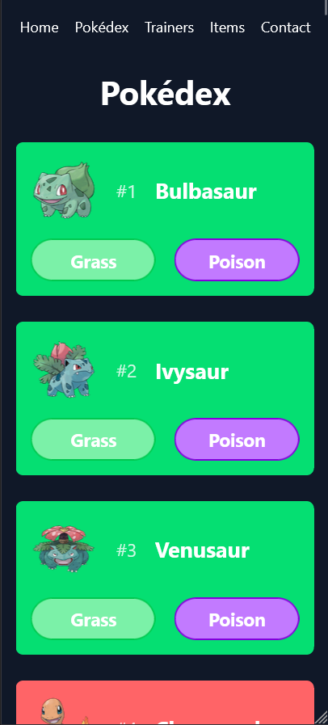

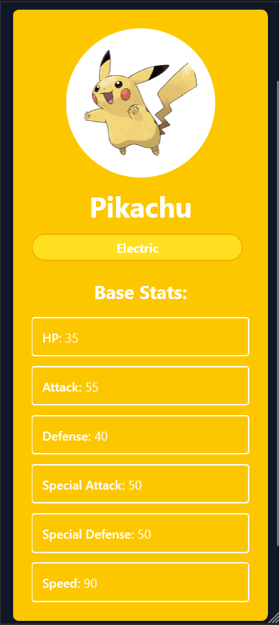

**Sistema de Itens**

- Catálogo de itens organizados por categoria
- Informações detalhadas de preço, efeito e descrição

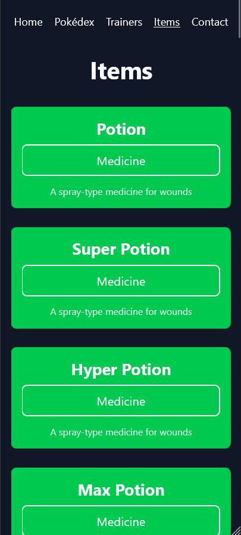

#### Interface de Usuário Moderna

- Design responsivo adaptável a diferentes tamanhos de tela
- Navegação intuitiva com header fixo e menu principal
- Estados de carregamento e tratamento de erros
- Componentes reutilizáveis para consistência visual

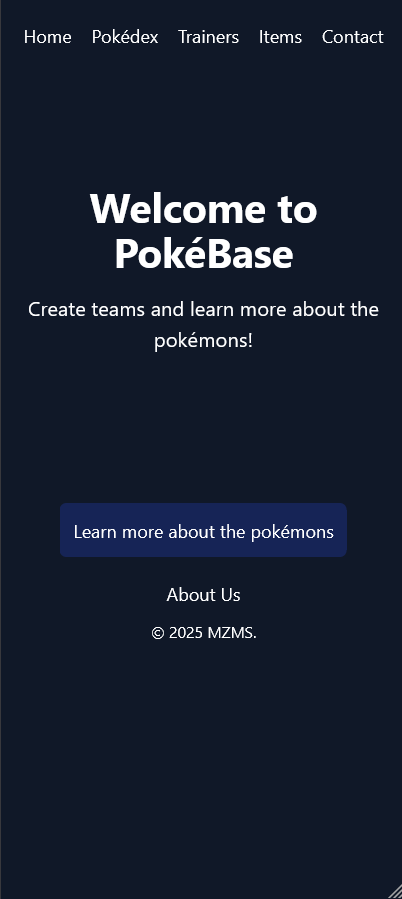

### 4.2 Conclusões e Trabalhos Futuros

Neste projeto, desenvolvemos uma aplicação web completa para gerenciamento de dados do universo Pokémon, utilizando tecnologias modernas como React no frontend e Express.js com PostgreSQL no backend. O sistema oferece funcionalidades abrangentes de CRUD (Create, Read, Update, Delete) para todas as entidades principais: treinadores, Pokémon, espécies, tipos, equipes, itens e categorias.

A aplicação demonstra uma arquitetura sólida baseada no padrão MVC, com separação clara entre as camadas de apresentação, lógica de negócio e persistência de dados. A interface desenvolvida em React proporciona uma experiência de usuário moderna e responsiva, enquanto a API REST garante comunicação eficiente entre frontend e backend.

#### Trabalhos Futuros

Como próximos passos para evolução da plataforma PokéBase, identificamos várias oportunidades de expansão que agregarão valor significativo aos usuários:

**Funcionalidades Interativas de Usuário:**

- Implementação de sistema de autenticação e autorização, permitindo que usuários criem contas personalizadas
- Desenvolvimento de interface para criação e gerenciamento de equipes Pokémon personalizadas
- Ferramenta de criação de Pokémon customizados com estatísticas balanceadas
- Sistema de inventário pessoal para gerenciamento de itens coletados

**Recursos Avançados:**

- Sistema de batalhas simuladas entre equipes de diferentes treinadores
- Calculadora de danos e efetividade entre tipos
- Gerador de moveset otimizado para competições

**Melhorias na Experiência do Usuário:**

- Dashboard personalizado para cada treinador
- Sistema de conquistas e badges virtuais
- Recursos de busca e filtros avançados
- Suporte para múltiplos idiomas

Essas expansões transformarão a PokéBase de um sistema de consulta em uma plataforma interativa completa, onde os entusiastas Pokémon poderão não apenas visualizar informações, mas criar, personalizar e gerenciar seus próprios times e estratégias de forma colaborativa e engajante.

## <a name="c5"></a>5. Referências

BULBAPEDIA. **Main Page**. Bulbapedia, the community-driven Pokémon encyclopedia. Disponível em: https://bulbapedia.bulbagarden.net/wiki/Main_Page. Acesso em: 10 jun. 2025.

---

---
